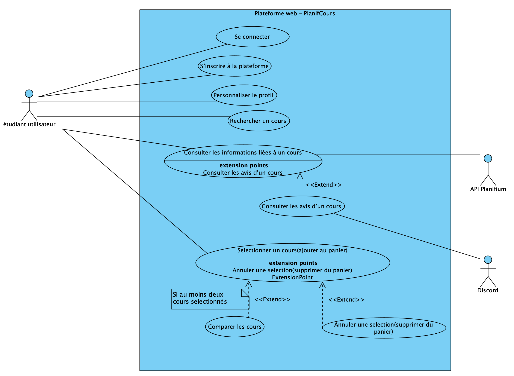

# Cas d'utilisation

## Vue d’ensemble

TODO: Introduction aux cas d’utilisation du système. (ajouter photo diagramme CU)

## Liste des cas d’utilisation

| ID | Nom | Acteurs principaux | Description |
|----|-----|---------------------|-------------|
| CU01 | Connexion | Étudiant utilisateur | L'utilisateur se connecte à l'application |
| CU02 | Inscription | Étudiant utilisateur | L'utilisateur crée un compte |
| CU03 | Profil | Étudiant utilisateur | L'utilisateur indique ses préférences |
| CU04 | Recherche cours | Étudiant utilisateur | L'utilisateur effectue une recherche par sigle, code, prof |
| CU05 | Infos cours | Étudiant utilisateur | L'utilisateur consulte les infos: plan de cours, prof, résultats académiques, avis |
| CU06 | Comparaison de cours | Étudiant utilisateur | L'utilisateur sélectionne plusieurs cours et voit comparaison (charge, difficulté, taux de réussite) |
| CU07 | Mis à jour cours | Administrateur | Vérifier ou corriger les infos venant de l’API si besoin |

## Détail

## CU01 - Connexion

**Acteurs** : Étudiant utilisateur (principal)
**Préconditions** : L’étudiant doit avoir un compte valide déjà créé
**PostConditions** : L’étudiant est authentifié et redirigé vers son tableau de bord
**Déclencheur** : L’étudiant saisit son identifiant et mot de passe
**Dépendances** : CU02 (Inscription)
**But** : Permettre à l’étudiant d’accéder à son espace personnalisé sur la plateforme

### Scénario principal

1. L’étudiant ouvre la page de connexion.  
2. L’étudiant saisit son **courriel** et **mot de passe**.  
3. Le système vérifie les informations.  
4. Le système authentifie l’étudiant.  
5. Le système affiche le **tableau de bord personnalisé**.  

### Scénarios alternatifs

### 3a. Le mot de passe est incorrect
- **3a.1** Le système affiche *« Mot de passe incorrect »*.  
- **3a.2** Le scénario reprend à l’étape 2.  

### 3b. Le compte n’existe pas
- **3b.1** Le système affiche *« Aucun compte trouvé avec cet email »*.  
- **3b.2** L’étudiant peut choisir de s’inscrire.  

---

## CU02 - Inscription

**Acteurs** : Étudiant utilisateur (principal)
**Préconditions** : L’étudiant n’a pas encore de compte sur la plateforme
**PostConditions** : Un compte étudiant est créé et stocké dans la base de données
**Déclencheur** : L’étudiant clique sur “S’inscrire” et fournit les informations requises
**Dépendances** : Aucune
**But** : Permettre à un nouvel étudiant de créer un compte sur la plateforme

### Scénario principal

1. L’étudiant ouvre la page d’inscription.  
2. L’étudiant saisit son **nom**, **matricule**, **courriel** et **mot de passe**.  
3. Le système vérifie que tous les champs obligatoires sont remplis.  
4. Le système vérifie que le courriel n’est pas déjà enregistré.  
5. Le système enregistre les informations dans la base de données.  
6. Le système confirme la création du compte.  
7. L’étudiant peut maintenant se connecter.  

### Scénarios alternatifs

### 3a. Des champs sont manquants
- **3a.1** Le système indique les champs à remplir.  
- **3a.2** Le scénario reprend à l’étape 2.  

### 4a. Le courriel est déjà utilisé
- **4a.1** Le système informe l’étudiant que le compte existe déjà.  
- **4a.2** Le scénario se termine : l’étudiant peut choisir **« Connexion »** à la place.  

---

### CU03 - Profil

**Acteurs** : Étudiant utilisateur (principal)
**Préconditions** : L’étudiant doit être connecté (CU01)
**PostConditions** : Les préférences de l’étudiant sont enregistrées et associées à son compte
**Déclencheur** : L’étudiant clique sur la section “Mon profil”
**Dépendances** : CU01 (Connexion)
**But** : Permettre à l’étudiant d’indiquer ses préférences pour recevoir des recommandations personnalisées

---

### CU04 - Recherche cours

**Acteurs** : Étudiant utilisateur (principal), API Planifium (secondaire)
**Préconditions** : L’étudiant doit être connecté (CU01)
**PostConditions** : Une liste de résultats correspondant aux critères est affichée
**Déclencheur** : L’étudiant saisit un critère de recherche
**Dépendances** : CU01 (Connexion), CU07 (Mise à jour cours) si données corrigées
**But** : Permettre à l’étudiant de trouver un cours via mot-clé, sigle ou professeur

### Scénario principal

1. L’étudiant ouvre la **barre de recherche**.  
2. L’étudiant saisit un **mot-clé** (sigle, titre, nom du prof).  
3. Le système interroge la **base de données / API Planifium**.  
4. Le système affiche la **liste des cours correspondants**.  
5. L’étudiant sélectionne un cours de la liste.  

### Scénarios alternatifs

### 3a. Aucun cours ne correspond
- **3a.1** Le système affiche *« Aucun cours trouvé »*.  
- **3a.2** Le scénario se termine.  

### 3b. L’API Planifium est indisponible
- **3b.1** Le système affiche *« Service temporairement indisponible »*.  
- **3b.2** Le scénario se termine.  

---

### CU05 - Infos cours

**Acteurs** : Étudiant utilisateur (principal), API Planifium (secondaire), Discord (secondaire)
**Préconditions** : L’étudiant doit être connecté (CU01)
**PostConditions** : Les informations du cours sont affichées à l’écran
**Déclencheur** : L’étudiant sélectionne un cours dans la liste de résultats (CU04)
**Dépendances** : CU04 (Recherche cours), CU07 (Mise à jour cours)
**But** : Permettre à l’étudiant de consulter le plan, l’horaire, le professeur, les résultats académiques et les avis d’un cours(s'il ya au moins 5 avis)

### Scénario principal

1. L’étudiant sélectionne un cours dans les **résultats de recherche**.  
2. Le système récupère les **données** (plan de cours, horaire, prof, résultats académiques).  
3. Le système récupère les **avis étudiants**.  
4. Le système affiche toutes les informations dans une **fiche de cours**.  

### Scénarios alternatifs

### 2a. Les résultats académiques ne sont pas disponibles
- **2a.1** Le système affiche seulement les **infos officielles** et les **avis**.  

### 3a. Pas encore assez d’avis étudiants (n < 5)
- **3a.1** Le système affiche un message *« Pas encore d’avis disponibles »*.  

---

### CU06 - Comparaison de cours

**Acteurs** : Étudiant utilisateur (principal), API Planifium (secondaire), Discord (secondaire)
**Préconditions** : L’étudiant doit être connecté (CU01) et avoir sélectionné au moins deux cours
**PostConditions** : Un tableau comparatif est affiché à l’étudiant
**Déclencheur** : L’étudiant clique sur l’option « Comparer » dans son panier après avoir choisi plusieurs cours.=
**Dépendances** : CU04 (Recherche cours), CU05 (Infos cours)
**But** : Permettre à l’étudiant de comparer plusieurs cours selon des critères (charge, difficulté, taux de réussite, retours d'autres étudiants)

### Scénario principal

1. L’étudiant ajoute plusieurs cours dans son panier depuis la **recherche**. 
2. L'étudiant va dans son panier et sélectionne **comparer les cours**. 
3. Le système récupère pour chaque cours : **charge estimée**, **taux de réussite**, **difficulté perçue**, **avis**.  
4. Le système affiche un **tableau comparatif clair**.  
5. L’étudiant consulte et choisit la **combinaison la plus adaptée**.  

### Scénarios alternatifs

### 1a. L’étudiant ne sélectionne qu’un seul cours
- **1a.1** Le système affiche un message *« Sélectionnez au moins 2 cours pour comparer »*.  

### 2a. Les données pour un des cours sont incomplètes
- **2a.1** Le système affiche un avertissement *« Informations partielles pour ce cours »*.  
- **2a.2** Le tableau reste affiché avec les données disponibles.

### 3a. API Planifium ou Discord est inaccessible:
- **2a.1** Le système affiche un message *« Les données externes ne sont pas accessibles pour le moment »*.  
- **2a.2** Le tableau est généré avec uniquement les données internes disponibles.
---

### CU07 - Mise à jour des cours

**Acteurs** : Administrateur (principal), API Planifium (secondaire)
**Préconditions** : L’administrateur est connecté avec des droits d’administration
**PostConditions** : Les données du cours sont mises à jour dans la base et rendues disponibles aux étudiants
**Déclencheur** : L’administrateur accède à l’interface de gestion des cours
**Dépendances** : Aucune
**But** : Permettre à l’administrateur de corriger ou compléter les données venant de l’API (ex. prof ou horaire modifié)