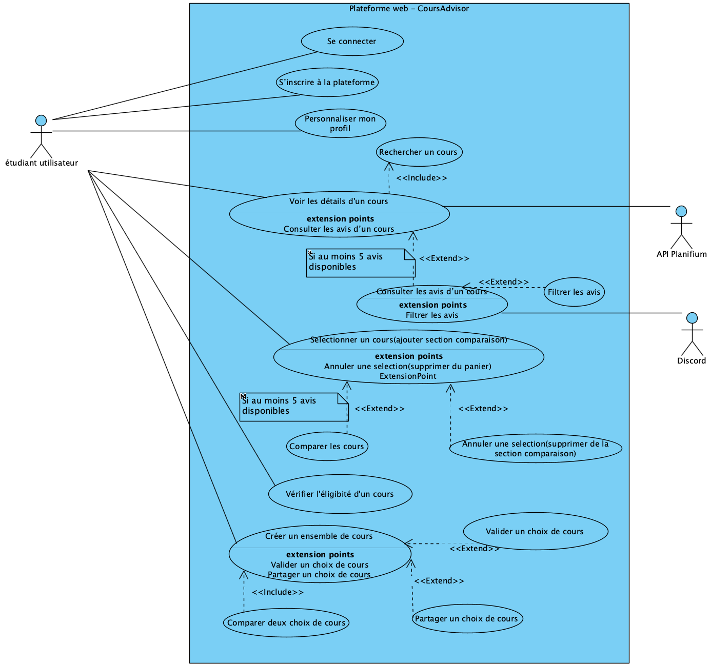

# Cas d'utilisation

## Vue d’ensemble

Introduction aux cas d’utilisation du système.

## Liste des cas d’utilisation

| ID | Nom | Acteurs principaux | Description |
|----|-----|---------------------|-------------|
| CU01 | Se connecter | Étudiant utilisateur | L'utilisateur se connecte à l'application |
| CU02 | S'inscrire à la plateforme | Étudiant utilisateur | L'utilisateur crée un compte |
| CU03 | Personaliser mon profil | Étudiant utilisateur | L'utilisateur indique ses préférences |
| CU04 | Rechercher un cours | Étudiant utilisateur | L'utilisateur effectue une recherche par sigle, code, prof |
| CU05 | Voir les détails d'un cours | Étudiant utilisateur | L'utilisateur consulte les infos: plan de cours, prof, résultats académiques, avis |
| CU06 | Comparer les cours | Étudiant utilisateur | L'utilisateur sélectionne plusieurs cours et voit comparaison (charge, difficulté, taux de réussite) |
| CU07 | Comparer deux choix de cours | Étudiant utilisateur | L'utilisateur sélectionne deux choix cours et voit comparaison globale (charge, difficulté, taux de réussite) |

## Détail

## CU01 - Se connecter

**Acteurs** : Étudiant utilisateur (principal)
**Préconditions** : L’étudiant doit avoir un compte valide déjà créé
**PostConditions** : L’étudiant est authentifié et redirigé vers la page d'accueil
**Déclencheur** : L’étudiant saisit son identifiant et mot de passe
**Dépendances** : CU02-S'inscrire à la plateforme (extend) utilisé uniquement si le compte n'existe pas.
**But** : Permettre à l’étudiant d’accéder à son espace personnalisé sur la plateforme

### Scénario principal

1. L’étudiant ouvre la page de connexion.  
2. L’étudiant saisit son **email** et **mot de passe**.  
3. L'étudiant clique sur se connecter.  
4. Le système vérifie la présence d'un compte associé.  
4. Le système vérifie la validité du mot de passe.
5. Le système génère une session d’utilisateur.
6. Le système affiche le **tableau de bord personnalisé**.  

### Scénarios alternatifs 

### 4a. Aucun compte trouvé (Extend CU02 : S’inscrire à la plateforme est activé ici)
- **4b.1** Le système affiche *« Aucun compte associé à cet email »*.  
- **4b.2** L’étudiant peut choisir de s’inscrire (CU02).  

### 5a. Le mot de passe est incorrect
- **5a.1** Le système affiche *« Mot de passe incorrect »*.  
- **5a.2** Le scénario reprend à l’étape 2. 

---

## CU02 - S'inscrire à la plateforme

**Acteurs** : Étudiant utilisateur (principal)
**Préconditions** : L’étudiant n’a pas encore de compte sur la plateforme
**PostConditions** : Un compte étudiant est créé et stocké dans la base de données
**Déclencheur** : L’étudiant clique sur “S’inscrire” et fournit les informations requises
**Dépendances** : Aucune
**But** : Enregistrer un nouvel étudiant et créer son compte

### Scénario principal

1. L’étudiant ouvre la page d’inscription.  
2. Il remplit les champs obligatoires : **nom**, **matricule**, **courriel** et **mot de passe**.  
3. Le système vérifie que tous les champs sont remplis correctement.  
4. Le système vérifie que le courriel n’est pas déjà utilisé.  
5. Le système crée un nouvel enregistrement en base de données.  
6. Le système confirme la création du compte.  
7. L’étudiant peut maintenant se connecter (CU01) (include).  

### Scénarios alternatifs

### 3a. Des champs sont manquants ou invalides
- **3a.1** Le système indique les champs à corriger.  
- **3a.2** Le scénario reprend à l’étape 2.  

### 4a. Le courriel est déjà utilisé
- **4a.1** Le système affiche « Ce courriel est déjà associé à un compte ». 
- **4a.2** L’étudiant est invité à aller vers CU01 (include).

---

### CU03 - Personaliser mon profil

**Acteurs** : Étudiant utilisateur (principal)
**Préconditions** : L’étudiant doit être connecté (CU01)
**PostConditions** : Les préférences de l’étudiant sont enregistrées et associées à son compte
**Déclencheur** : L’étudiant clique sur la section “Mon profil”
**Dépendances** : CU01- Se connecter (include)
**But** : Permettre à l’étudiant d’indiquer ses préférences pour recevoir des recommandations personnalisées

---

### CU04 - Rechercher un cours

**Acteurs** : Étudiant utilisateur (principal), API Planifium (secondaire)
**Préconditions** : L’étudiant doit être connecté (CU01)
**PostConditions** : Une liste de résultats correspondant aux critères est affichée
**Déclencheur** : L’étudiant saisit un critère de recherche
**Dépendances** : CU05- Voir les détails d'un cours (include) lorsque l’étudiant clique sur un résultat 
**But** : Permettre à l’étudiant de trouver un cours selon différents critères comme mot-clé, sigle ou professeur

### Scénario principal

1. L’étudiant ouvre la **barre de recherche**.  
2. L’étudiant saisit un **critère de recherche** (code, titre, mots-clés).  
3. Le système interroge la **base de données interne**.  
4. Le système interroge **API Planifium**.  
5. Le système affiche la **liste des cours correspondants**.  
6. L’étudiant sélectionne un cours -> déclenche CU05 (include).  

### Scénarios alternatifs

### 3a. Cours trouvé dans la base interne
- **3a.1** Le système passe à l'étape 5. 

### 3b. Aucun cours ne correspond dans la base interne
- **3b.1** Le système passe à l'étape 4.  

### 4a. Service API indisponible
- **4a.1** Le système affiche le message « Service API Planifium non disponibles ».  
- **4a.2** Le scénario se termine.  

### 4b. Le service API Planifium ne retourne aucun cours
- **4b.1** Le système affiche le message « Aucun cours trouvé ».  
- **4b.2** Le scénario se termine.  

### 4c. Le service API Planifium retourne la liste de cours correspondants au critère de recherche
- **4c.1** Le système mis à jour la base interne des cours.    
- **4c.2** Le scénario passe à l'étape 5.  
---

### CU05 - Voir les détails d'un cours

**Acteurs** : Étudiant utilisateur (principal), API Planifium (secondaire), Discord (secondaire)
**Préconditions** : L’étudiant doit être connecté (CU01)
**PostConditions** : Les informations du cours sont affichées à l’écran
**Déclencheur** : L’étudiant sélectionne un cours dans la liste de résultats (CU04)
**Dépendances** : CU04- Rechercher un cours (include) + Consulter les avis (extend) + filter les avis (extend)
**But** : Permettre à l’étudiant de consulter le plan, l’horaire, le professeur, les résultats académiques, degré de difficulté, charge de travail et les avis d’un cours(s'il ya au moins 5 avis)

### Scénario principal

1. L’étudiant sélectionne un cours dans les **résultats de recherche** (CU04).  
2. Le système récupère les **données officielles** (description de cours, horaire, prof).  
3. Le système récupère les **résultats académiques**. 
4. Le système récupère les **avis étudiants** via Discord.  
5. Le système vérifie si au moins 5 avis sont disponibles (Extend : Consulter les avis).  
6. Le système affiche toutes les informations dans une **fiche de cours**: horaire, plan, prof, charge, difficulté, réussite, avis.  

### Scénarios alternatifs

### 3a. Les résultats académiques ne sont pas disponibles
- **3a.1** Le système affiche « Données académiques non disponibles ».  
- **3a.2** Continuer à l’étape 4.  

### 5a. Moins de 5 avis disponibles (extend CU : Consulter avis désactivé + extend CU : Filtrer les avis désactivé)
- **5a.1** Le système affiche un message *« Pas encore d’avis disponibles »*.  
- **5a.2** La fiche est affichée sans section avis.  

### 6a. Besoin de filtrer les avis (extend CU : Filtrer les avis)
- **6a.1** Dans la section avis, l’étudiant demande un filtrage (par note, par semestre).  
- **6a.2** Le système applique les filtres.  
- **6a.2** Le système mis à jour l'affichage des avis.  

---

### CU06 - Comparer les cours

**Acteurs** : Étudiant utilisateur (principal), API Planifium (secondaire), Discord (secondaire)
**Préconditions** : L’étudiant doit être connecté (CU01) et avoir sélectionné au moins deux cours suite à une recherche (CU04)
**PostConditions** : Un tableau comparatif est affiché à l’étudiant
**Déclencheur** : L’étudiant choisit plusieurs cours dans la page d'accueil suite à une recherche de cours effectuée et se dirige vers page comparaison et clique sur « Comparer les cours ».
**Dépendances** : CU04 (Recherche cours), CU05 (Infos cours), “Annuler une sélection” (extend)
**But** : Aider l’étudiant à comparer plusieurs cours selon des critères objectifs (charge, difficulté, réussite, avis)

### Scénario principal

1. L’étudiant accède à la page "Comparer les cours".   
2. Le système vérifie que l’étudiant a sélectionné au moins 2 cours.   
3. Pour chaque cours sélectionné, le système vérifie s’il existe déjà dans la base interne.(même logique que CU04).  
4. Le système récupère pour chaque cours : **charge estimée**(Planifium), **taux de réussite**, **difficulté perçue**, **avis** (avec même logique que CU05).  
5. Le système analyse si les données sont complètes.  
6. Le système génère un tableau comparatif.  
7. Le système affiche le tableau comparatif final.  
8. L’étudiant consulte les résultats et décide du cours à choisir.  

### Scénarios alternatifs

### 2a. L’étudiant ne sélectionne qu’un seul cours
- **2a.1** Le système affiche un message *« Sélectionnez au moins 2 cours pour comparer »*.  
- **2a.1** Fin.  

### 3a. API Planifium ou Discord est inaccessible:
- **3a.1** Le système affiche un message *« Les données externes ne sont pas accessibles pour le moment »*.  
- **3a.2** Le tableau est généré avec uniquement les données internes disponibles.  
- **3a.3** Le système passe à l'étape 7.  

### 4a. L’étudiant retire un cours (Extend : Annuler une sélection)
- **4a.1** L’étudiant supprime un cours du panier de comparaison.  
- **4a.2** Le système met à jour la liste.  
- **4a.3** Si moins de 2 cours, retour à l’alternative 2a.  

### 5a. Les données pour un des cours sont incomplètes (Pas assez d'avis pour un cours donné n<5 )
- **5a.1** Le système affiche un avertissement *« Informations partielles pour ce cours »*.  
- **5a.2** Le tableau est généré avec les données disponibles uniquement.  
- **5a.3** Le système passe à l'étape 7.  

---

### CU07 - Comparer deux choix de cours

**Acteurs** : Étudiant utilisateur (principal), API Planifium (secondaire), Discord (secondaire).
**Préconditions** : L’étudiant doit être connecté (CU01), l’étudiant a constitué au moins deux choix, chacun contenant au minimum deux cours (Cas: Créer un ensemble de cours - include).
**PostConditions** : Un tableau comparatif est affiché à l’étudiant entre les deux choix, contenant des indicateurs agrégés : charge totale ou moyenne, difficulté moyenne estimée, taux de réussite moyen et nombre d’avis ou indicateurs qualitatifs par choix de cours.
**Déclencheur** : L’étudiant choisit plusieurs cours dans la page d'accueil suite à une recherche de cours effectuée, se dirige vers page comparaison de choix , constitue ces 2 ensembles de cours qu'il veut comparer et clique sur « Comparer mes choix ».
**Dépendances** : CU04 (Recherche cours), CU05 (Infos cours), “Annuler une sélection” (extend), "Créer un ensemble de cours" (include).
**But** : Aider l’étudiant à comparer deux ensembles de cours pour choisir la meilleure combinaison selon :
la charge globale, la difficulté anticipée, les taux de réussite, et les avis étudiants. L’objectif est de faciliter un choix académique éclairé entre deux chemins possibles pour un futur trimestre.  
