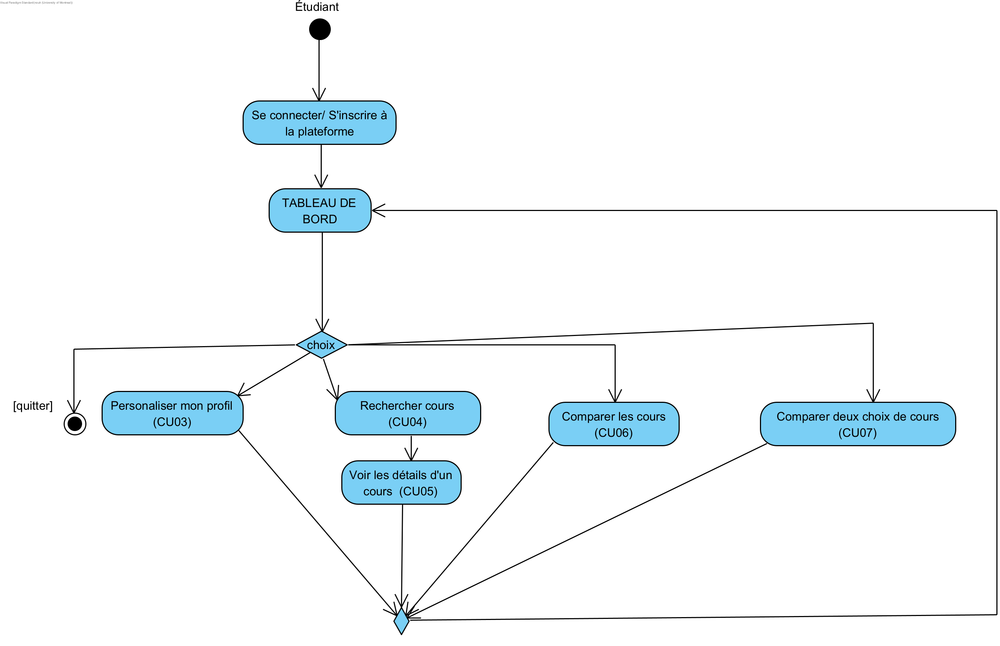
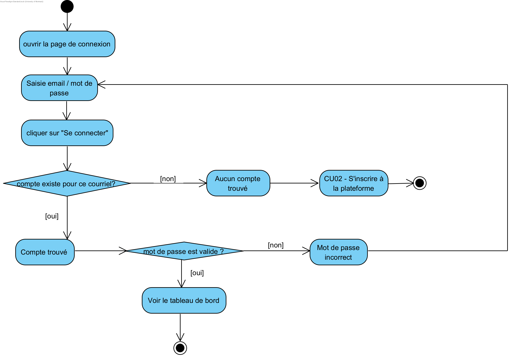
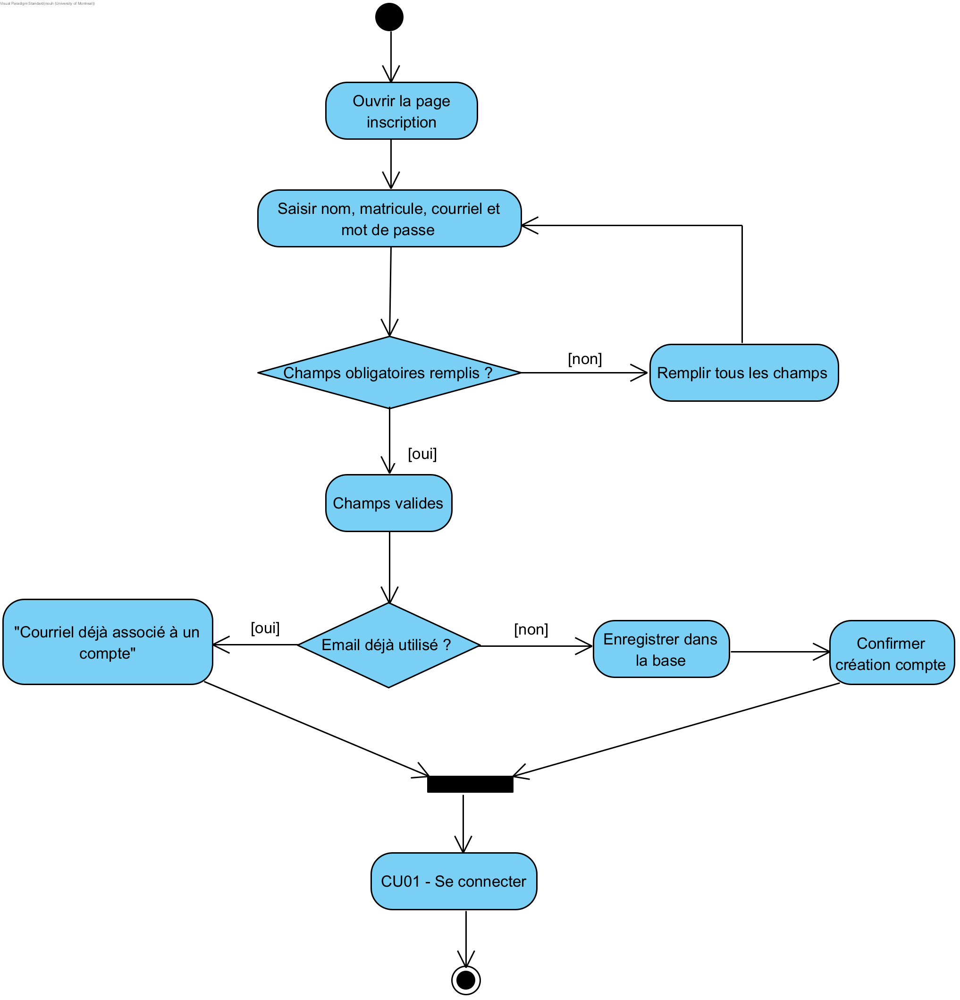
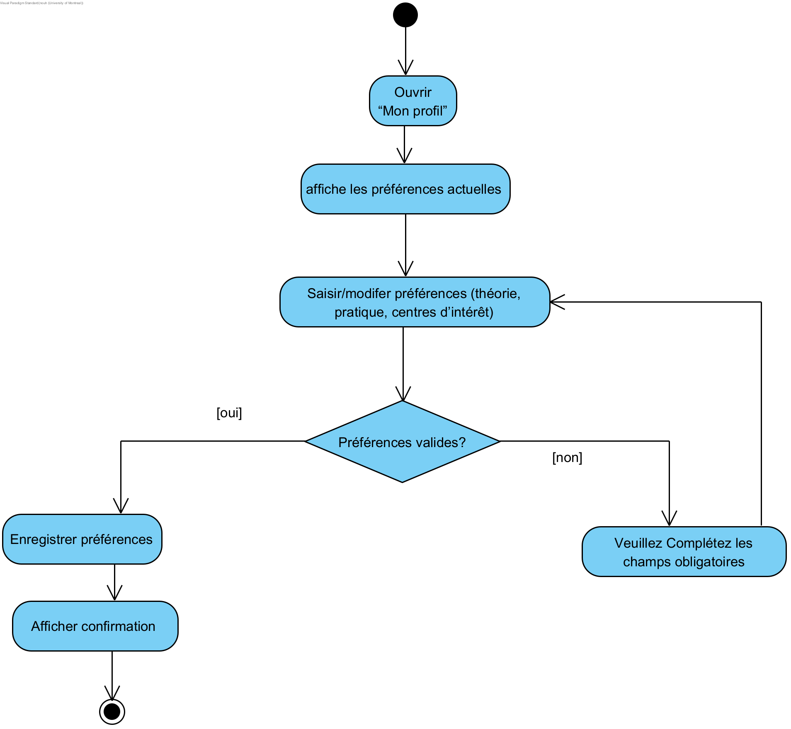
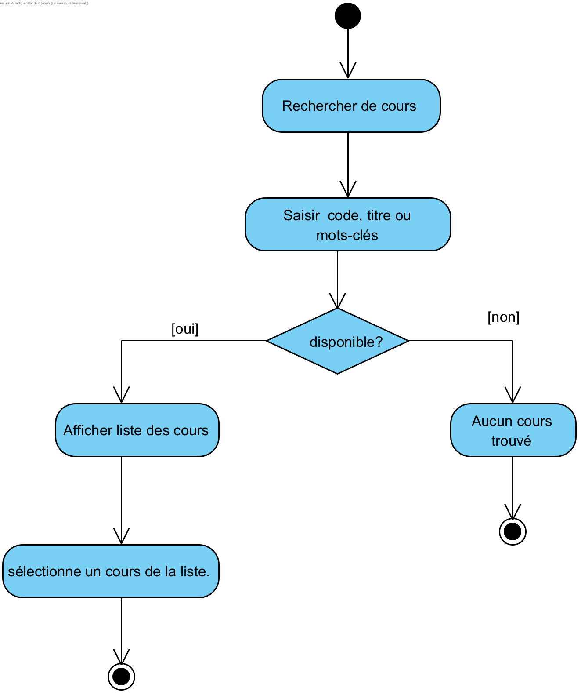
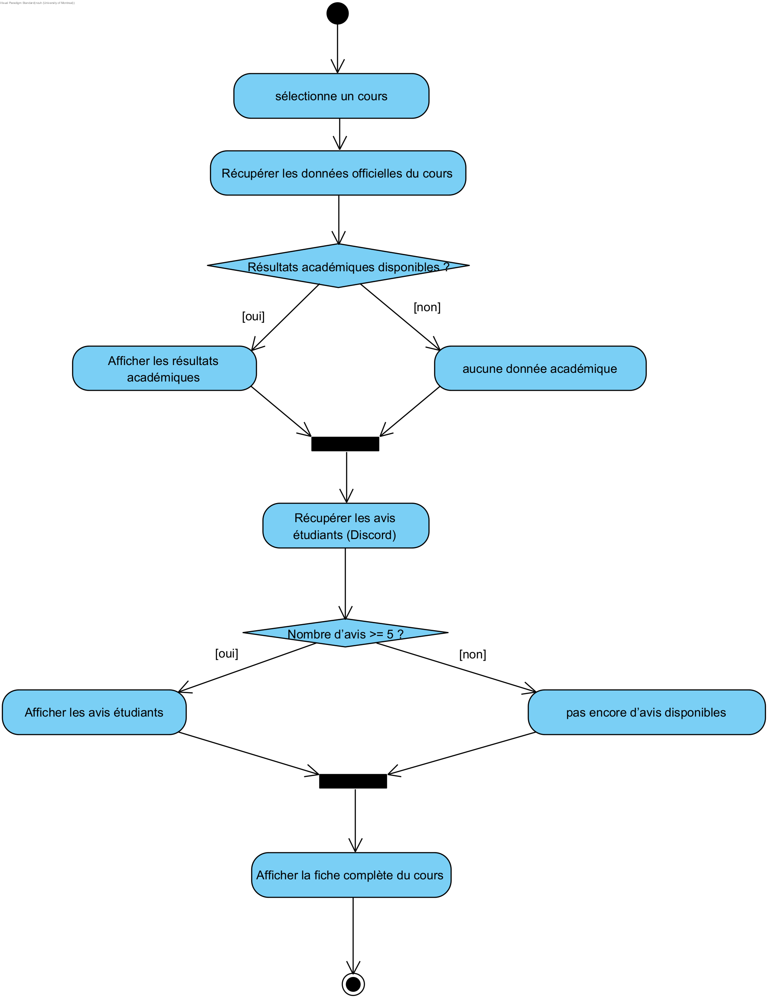
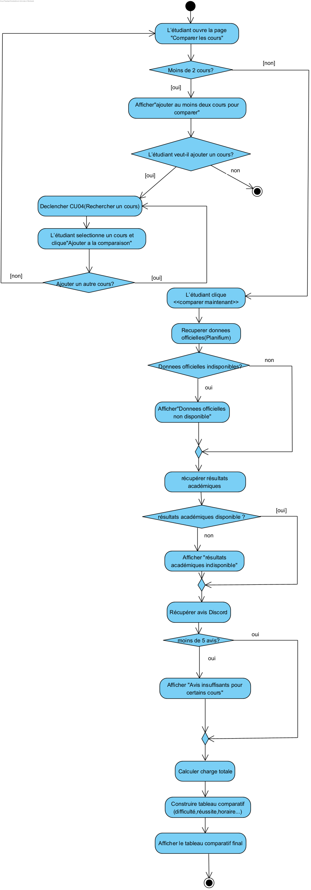

# Flux principaux

## Objectif

Décrire les flux d’interaction entre les acteurs et le système.

## Diagrammes
## Diagramme global

## CU01 - Connexion

## CU02 - Inscription

## CU03 - Profil

## CU04 - Recherche cours

## CU05 - Infos cours

## CU06 - Comparaison de cours

## CU07 - Mise à jour des cours

### Description des flux complexes

