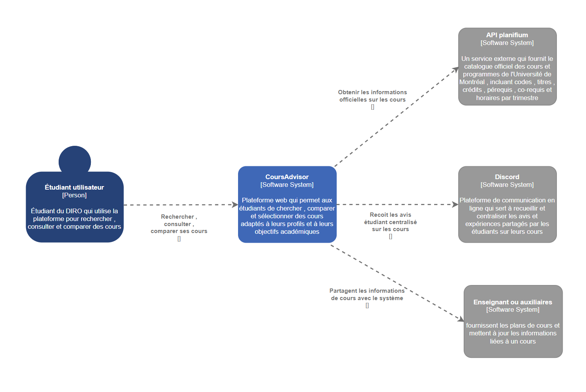
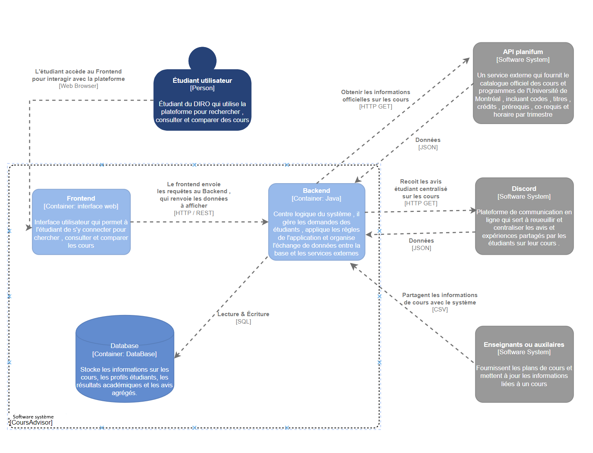

# Architecture du système

## Vue d’ensemble

- Description du type d’architecture retenue (ex. : monolithique, microservices, REST...)
- Raisons du choix

## Composants principaux

- Liste des modules ou services :
  - Module d’authentification
  - Gestion des utilisateurs
  - Interface (frontend)
  - API backend

## Communication entre composants

- Mécanismes d’échange : appels HTTP, WebSocket, messages, etc.
- Format des données : JSON, XML, etc.

## Diagramme d’architecture (Modèle C4)

### Diagramme d’architecture - Niveau 1

---
### Diagramme d’architecture - Niveau 2
